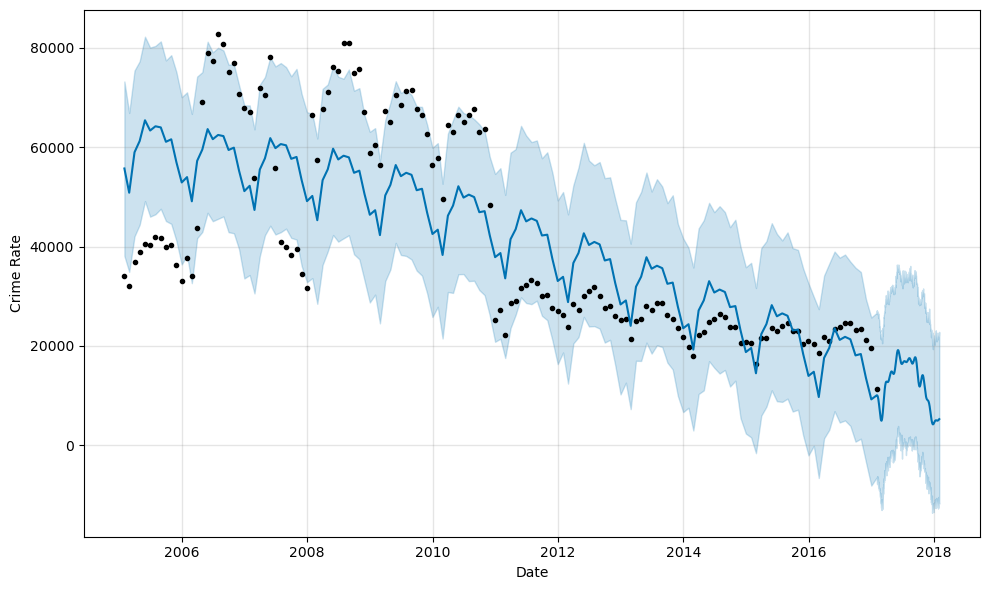
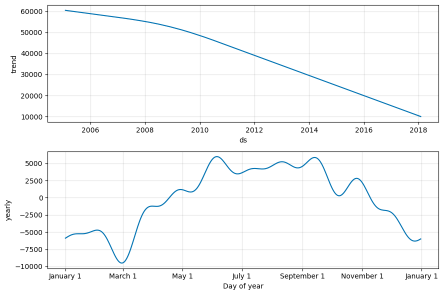

# 🚔🔍 Chicago Crime Rate Prediction

A time series forecasting project that predicts monthly crime rates in Chicago using **Facebook Prophet**.  
This notebook walks through the full pipeline — from dataset exploration and cleaning, to model building, forecasting, and evaluation — to uncover trends and make future predictions.

    

<p align="left"><em>Figure 1: Crime Rate Prediction Of Next Year</em></p> 
<p align="right"><em>Figure 2: Trends And Seasonality Prediction Of Next Year</em></p>


---

## 📑 Table of Contents
- [🚀 Project Overview](#-project-overview)
- [🗃️ Dataset Overview](#-dataset-overview)
- [⚙️ Setup](#-setup)
- [📥 Data Loading & Exploration](#-data-loading--exploration)
- [🧹 Data Preparation](#-data-preparation)
- [🔮 Modeling with Prophet](#-modeling-with-prophet)
- [📈 Forecasting & Evaluation](#-forecasting--evaluation)
- [✅ Conclusions](#-conclusions)
- [🤝 Contributing](#-contributing)
- [📄 License](#-license)

---

## 🚀 Project Overview

Chicago’s public crime dataset contains detailed records of reported crimes over several years.  
In this project, we:
- Analyze historical crime data to uncover trends.
- Build a **time series forecasting model** using Facebook Prophet.
- Predict monthly crime rates for future periods.
- Visualize trends and seasonal patterns to provide actionable insights.

---

## 🗃️ Dataset Overview

- 📍 **Source:** [Kaggle — Crimes in Chicago dataset](https://www.kaggle.com/currie32/crimes-in-chicago)  
- 🗓️ **Timeframe:** Historical crime records spanning multiple years.  
- 📊 **Features:**
  - Date and time of incident  
  - Type of crime  
  - Location  
  - District, beat, and coordinates  


---

## ⚙️ Setup

### 🔧 Requirements
- Python 3.7+  
- Libraries:
  - pandas  
  - numpy  
  - matplotlib  
  - seaborn  
  - prophet (fbprophet)

### 🧰 Install dependencies:
```bash
pip install pandas numpy matplotlib seaborn prophet
```
### 📂 Clone this repo

You can clone this repository to your local machine using:

```bash
git clone https://github.com/your-username/chicago-crime-forecast.git
cd chicago-crime-forecast
```
### 🗂️ Download Datasets

Download the three datasets (excel files) from: [Datasets](https://www.kaggle.com/currie32/crimes-in-chicago).


**Datasets to Download:** Chicago_Crimes_2005_to_2007.csv, Chicago_Crimes_2008_to_2011.csv, Chicago_Crimes_2012_to_2017.csv

## 📥 Data Loading & Exploration

We load the Chicago crime dataset, explore its structure, check for missing values, and analyze key trends.  
Exploratory data analysis (EDA) highlights seasonal and yearly patterns in crime incidents.

---

## 🧹 Data Preparation

We clean and transform the dataset:
- Handle missing or inconsistent values.
- Convert date columns to datetime format.
- Aggregate records by month to build a clean time series.

---

## 🔮 Modeling with Prophet

We use **Facebook Prophet**, a powerful open-source forecasting library, to:
- Model monthly trends and seasonal patterns.
- Fit the model on the historical data.
- Generate forecasts for future months.

Prophet is ideal for time series data with strong seasonality and trends.

---

## 📈 Forecasting & Evaluation

We visualize the model’s predictions and evaluate its performance on a hold-out test set.  
Key outputs:
- 📊 Forecasted monthly crime counts.
- 📈 Trend and seasonality decomposition.
- 🔍 Residual analysis to assess fit.

---

## ✅ Conclusions

- Crime rates show clear seasonal and yearly trends.
- The Prophet model provides a reasonable forecast for future years (in our case 2018).
- Further improvements could include incorporating external regressors (weather, events, etc.) or modeling specific crime categories.

---

## 🤝 Contributing

Contributions, feature requests, and issues are welcome!  
Feel free to fork this repo, improve the notebook, and submit a pull request.


